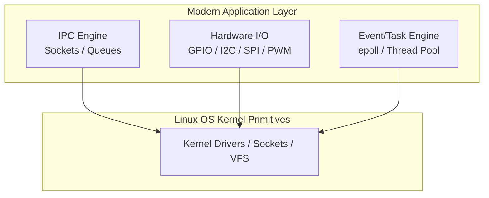
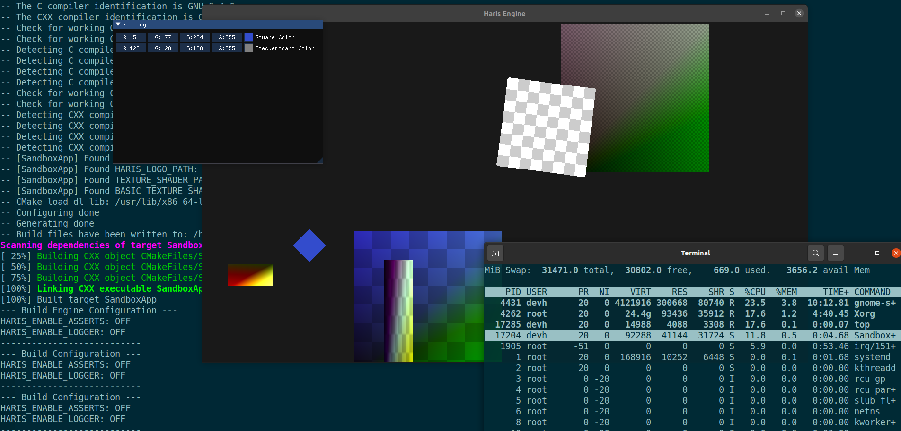
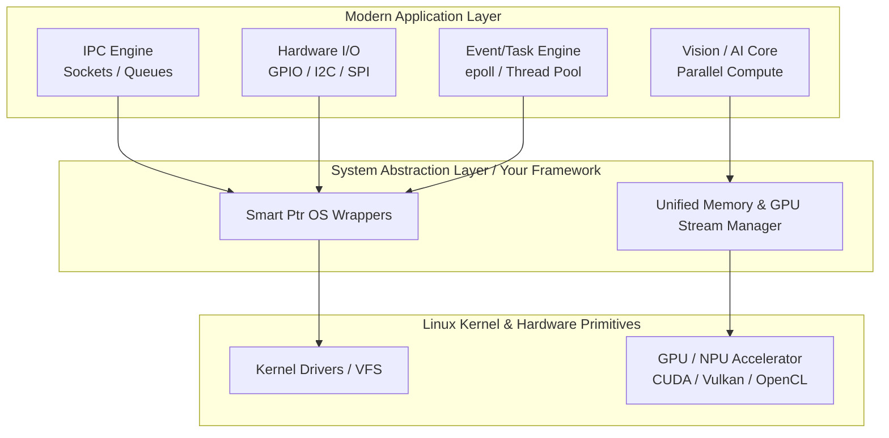

# Knowledge Acquisition
A minimalist repository tracking my journey in Embedded Systems, AI, and Linux ...

### Setup code built root for all dependencies
```sh
source setup_environment.sh
```
# Linux Integration
```sh
cd linux/
```
---

<!-- Auto-generated - Do not edit directly -->

# How to intergrate googletest to the system.

## Description
Project Technical Description Project Title: Ultra-Lightweight Modern C++ Embedded Linux System Abstraction Layer (SAL) High-Level Overview. This project delivers a highly optimized, modern C++ framework designed to encapsulate low-level Linux system domains into a clean, modular Application Programming Interface (API). Engineered specifically for resource-constrained embedded systems, the architecture utilizes modern C++ design patterns (RAII, smart pointers, and move semantics) to eliminate memory leaks and guarantee deterministic behavior. By decoupling the underlying OS primitives from the application layer, this framework provides a future-proof, easily extensible, and highly maintainable foundation for modern embedded applications.

## Core Architectural Pillars

### 1. Encapsulated Linux Domains (Implemented)
 Modern Inter-Process Communication (IPC) Wrapper: Object-oriented abstraction of Linux IPC mechanisms (POSIX/System V Message Queues, Shared Memory, and Unix Domain Sockets) managed via std::unique_ptr and std::shared_ptr to ensure safe lifecycle management.Production-Ready Blueprints: A comprehensive suite of minimal-overhead implementation samples demonstrating zero-copy data transfer and lock-free synchronization techniques.

### 2. Advanced System Modules & Components (Proposed Roadmap)
 To fully empower your application layer and maximize hardware utilization, the framework should expand to incorporate the following modern sub-systems:



**Asynchronous Event Loop Engine (epoll Wrapper):** A non-blocking I/O multiplexing engine utilizing Linux epoll to drive high-performance, single-threaded or multi-threaded event dispatching for timers, sockets, and file descriptors.
**Hardware Abstraction Layer (HAL) Modules:** Smart pointer-driven controllers for hardware interfaces, including memory-mapped GPIO, I2C, SPI, and PWM, featuring automated configuration backup and hardware teardown.
**Deterministic Thread Pool & Task Scheduler:** A lightweight, real-time-friendly task runner utilizing standard threads bound to specific CPU cores (CPU affinity) to prevent priority inversion and context-switching overhead.
**Zero-Allocation Logging & Diagnostics Subsystem:** A lock-free, asynchronous ring-buffer logging framework that formats strings compile-time to prevent heap fragmentation during critical operations.
**Dynamic Module Plugin Loader:** A dlfcn (dynamic linking) wrapper allowing the system to hot-plug compiled .so modules at runtime without restarting the main core service.

#### Technical Highlights & Embedded Suitability
**Zero Memory Leaks:** Complete elimination of raw pointers in favor of custom-deleter smart pointers to manage underlying Linux file descriptors (fd).
**Header-Only Friendly & Low Footprint:** Designed to minimize binary bloat, ensuring compatibility with tight flash and RAM constraints.
**Strict Exception Safety:** Optional exception handling (-fno-exceptions compatible) with robust error-code routing tailored for real-time embedded environments.

### 3. Heterogeneous Compute & GPU Acceleration Pipeline (In Parallel Development)
To meet the demands of modern edge AI, computer vision, and high-throughput data processing, the framework is expanding its ecosystem to support parallel heterogeneous computing, offloading intensive tasks from the CPU to the GPU.

*   **Zero-Copy Unified Memory Management:** Wrappers around Unified Memory architectures (e.g., NVIDIA CUDA Managed Memory, OpenCL Shared Virtual Memory) using custom-deleter smart pointers. This ensures zero-copy overhead when sharing data buffers between the Linux CPU host and the GPU device.
*   **Hardware-Accelerated Pipeline Abstraction:** A modular API layer that encapsulates low-level GPU compute pipelines (CUDA Streams, Vulkan Compute Shaders, or OpenCL Contexts). It allows the application layer to easily submit parallel processing kernels (e.g., for matrix multiplication, signal processing, or image manipulation) without managing raw driver handles.

***TODO:***

*   **Asynchronous GPU Event Synchronization:** Integration of GPU execution fences and streams into the existing `epoll`-driven Event Engine. This allows the application to yield CPU execution until the GPU finishes hardware tasks, maximizing overall deterministic system efficiency.
*   **Edge AI Inference Runtime Wrapper:** A lightweight abstraction for loading and executing quantized deep learning models (via ONNX Runtime, todo TensorRT, or OpenVINO) targeting specialized embedded NPU/GPU hardware.

### Sub-Repo source (Contact):
**Contact Info**
* **Email:** [lequochaidevh@gmail.com](mailto:lequochaidevh@gmail.com)
* **Phone:** [+84 (084)2013829](tel:+0842013829)

<p align="center">
  
</p>

💡 Note: The quality and frame rate of this demo have been reduced to optimize file size for the repository.




## Build and Install system project.

**Prerequisites:**
1. Install dependancy libraries: 
    [Manual install third-party guide](./third-party/guide.md)
    (todo add script to install all third-party libs)

2. Set up environment. `source setup_environment.sh`


### Linux Common

**Check set up root**
```sh
echo $LOCAL_MINOR_ROOT
```
**Note:** Check `source setup_environment.sh` 
at <path/to/knowledge-acquisition/> not got `$LOCAL_MINOR_ROOT`.

**Create build direction**
```sh
mkdir build
cd build/
```

**Internal project installation.**
```sh
make
make install
```
**Note:** Check internal_root when counter failed.

### Linux Embedded (todo)

### Linux Ubuntu (todo)
