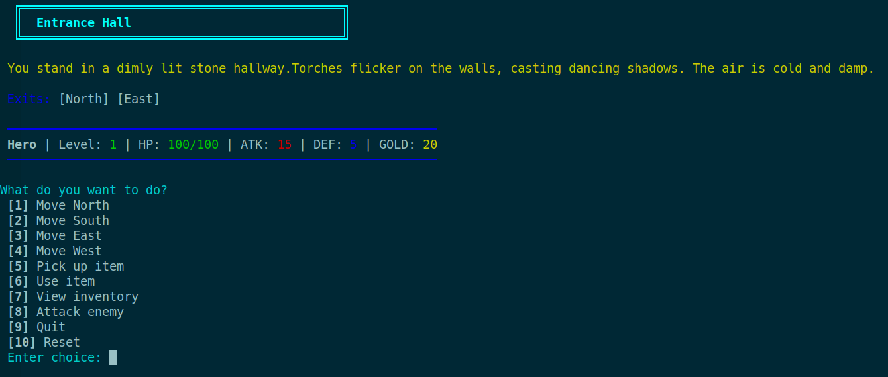

# Dungeon colection

### Description
That is a terminal game, using state machine pattern and OOP with C language program.

### Preview


### Build and Play
```sh
rm -rf build/ && mkdir build/ && gcc dungeon.c -o build/dungeon && ./build/dungeon
```

### Todo: Can add it to cmake for build system like item.
