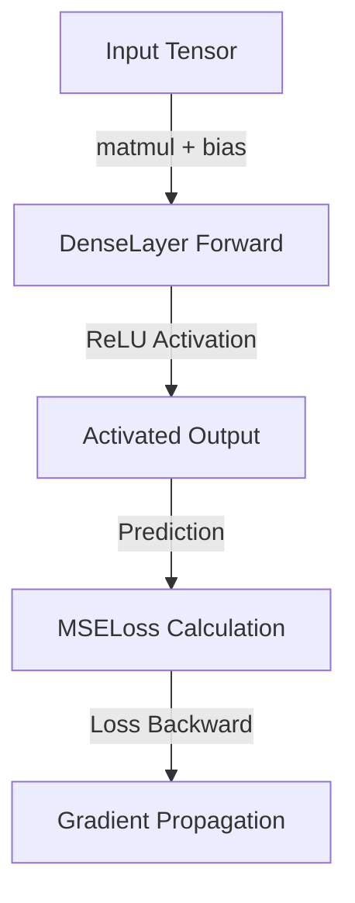

# Tiny AI Library in C++

A lightweight, scratch-built C++ machine learning library implementing core tensor operations, activation functions, neural network layers, and loss functions.

---

## Architecture Overview

---

## Core Components & Functions

### 1. `Tensor2D` (`include/Tensor2D.h`)
Manages 2D numerical data arrays (matrices) using dynamic memory allocation.

* **`Tensor2D(r, c, val)`**: Constructor allocating a matrix of size r × c initialized with `val`.
* **`at(r, c)`**: Accesses or modifies matrix elements at row `r` and column `c` with bounds checking.
* **`print()`**: Outputs matrix data to the console cleanly.
* **`matmul(other)`**: Performs matrix multiplication (C = A × B), validating inner dimensions.
* **`relu()`**: Applies the piecewise linear ReLU activation function element-wise (f(x) = max(0, x)).
* **`relu_backward(grad)`**: Computes the backward pass gradient for ReLU.

### 2. `DenseLayer` (`include/DenseLayer.h`)
Implements a fully-connected feedforward neural network layer.

* **`DenseLayer(in_features, out_features)`**: Initializes weight matrices using a normal distribution and bias vector to zero.
* **`forward(input)`**: Computes linear transformation Output = (Input × Weights) + Bias.

### 3. `MSELoss` (`include/Loss.h`)
Computes regression error and gradients using Mean Squared Error.

* **`forward(pred, target)`**: Calculates average squared error between predictions and ground truths.
* **`backward(pred, target)`**: Computes gradient 2/N * (pred - target) for backpropagation.
