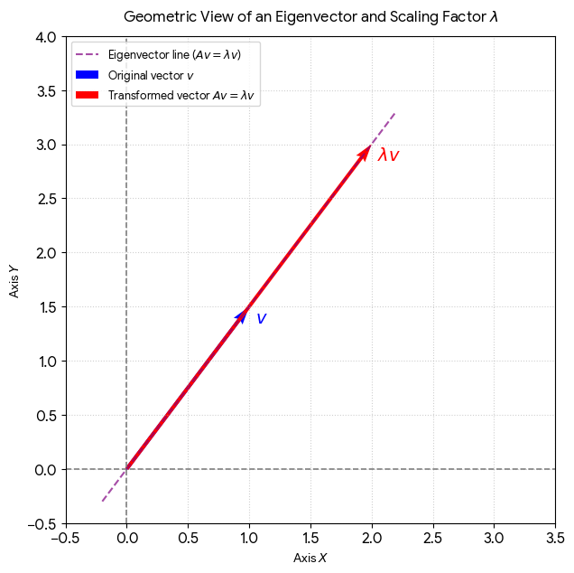

---

## 1. Core Mathematical Formulas & Concepts

### Linear Transformations
A matrix acts as a dynamic action altering space rather than a static grid of numbers. A transformation is **linear** if lines remain straight and the origin \((0,0)\) stays fixed. 
The columns of a transformation matrix represent the new landed coordinates of the standard basis vectors \(\hat{i}\) and \(\hat{j}\).

\[A = \begin{bmatrix} \color{green}{a} & \color{blue}{b} \\ \color{green}{c} & \color{blue}{d} \end{bmatrix} \implies \hat{i}_{new} = \begin{bmatrix} \color{green}{a} \\ \color{green}{c} \end{bmatrix}, \quad \hat{j}_{new} = \begin{bmatrix} \color{blue}{b} \\ \color{blue}{d} \end{bmatrix}\]

### Determinant (\(\det\))
Measures the scaling factor of area (in 2D) or volume (in 3D) after space undergoes a linear transformation. If \(\det(A) = 0\), space squishes into a lower dimension, causing irreversible data loss.

* **2x2 Matrix Determinant:**
  \[\det \begin{bmatrix} a & b \\ c & d \end{bmatrix} = ad - bc\]

* **3x3 Matrix Determinant (Laplace Expansion along Row 1):**
  \[\det \begin{bmatrix} a & b & c \\ d & e & f \\ g & h & i \end{bmatrix} = a(ei - fh) - b(di - fg) + c(dh - eg)\]

### Matrix Multiplication (Rectangular Configuration)
To multiply matrix \(A\) by matrix \(B\), the column count of \(A\) must precisely match the row count of \(B\).
\[\text{Shape Rule: } (M 	imes K) \cdot (K 	imes N) \longrightarrow (M 	imes N)\]

### Eigenvalues (\(\lambda\)) & Eigenvectors (\(v\))

- Multiplying a matrix by a vector transforms space: it rotates the vector to a new direction and scales its length.
- However, within that space, there are always a few "special" vectors. When acted upon by the matrix, they do not rotate at all; they stay on their original span, only their length is scaled (or flipped).
- The scaling factor (λ) by which that eigenvector is stretched or squished.

# Linear Algebra for Machine Learning: Cheat Sheet & C++ Core

This reference document compiles essential Linear Algebra concepts, geometric meanings, and their highly optimized, compile-time (`constexpr`) C++ implementations designed for Machine Learning pipelines.

Special vectors that do not change their span/direction when transformed by a matrix \(A\); they are merely scaled by a factor of \(\lambda\). Used fundamentally in Dimensionality Reduction (PCA).

\[\text{Core Equation: } A \cdot v = \lambda \cdot v \implies \det(A - \lambda I) = 0\]

---

## 2. Omnipotent & Optimized C++ Template Matrix Engine

This single-header architecture supports **rectangular matrices**, **shorthand square allocation**, **compile-time valuation (`constexpr`)**, and contains a CPU-cache-optimized spatial streaming order.

