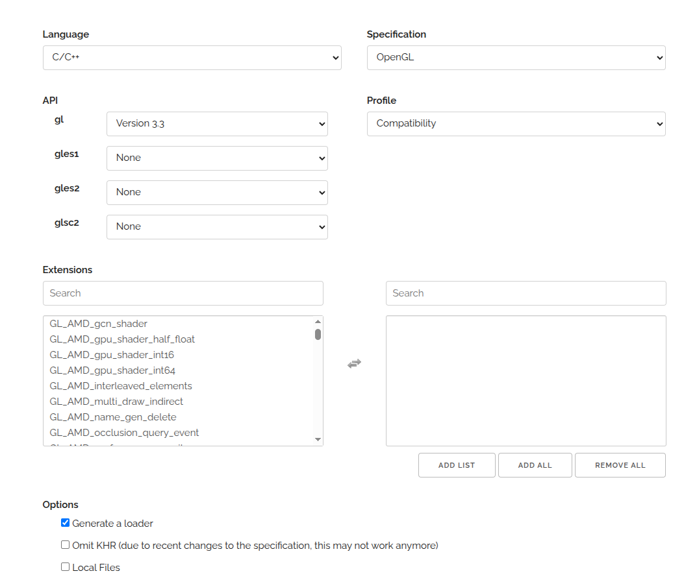

# How to intergrate glfw3 and glad to the system.


## Description
- Intergrate glfw3 and glad to internal system of the project.
- Support for c++ 17.

## Install glfw3 and glad for internal project.

**Check set up root to install libraries**
```sh
echo $LOCAL_MINOR_ROOT
```

**Get glfw3 and glad source for ubuntu 20 (c++17 - no mention).**

**GLFW:**
```sh
sudo apt-get update && sudo apt-get install -y cmake build-essential libxorg-dev libx11-dev libgl1-mesa-dev

git submodule add https://github.com/glfw/glfw.git

cd glfw

cmake .. -DCMAKE_INSTALL_PREFIX="$LOCAL_MINOR_ROOT" \
         -DCMAKE_BUILD_TYPE=Release \
         -DGLFW_BUILD_EXAMPLES=OFF \
         -DGLFW_BUILD_TESTS=OFF \
         -DGLFW_BUILD_DOCS=OFF
```

**Internal project installation.**
```sh
make -j$(nproc --ignore=2)
make install
cd ../..
```

**GLAD:** (Haris)

```sh
# Creat .cpp and .h
# https://glad.dav1d.de/
# config like below:
```



```sh
# download + create cmake and build
mkdir build && cd build
cmake .. -DCMAKE_INSTALL_PREFIX=$LOCAL_MINOR_ROOT
make
make install
```
